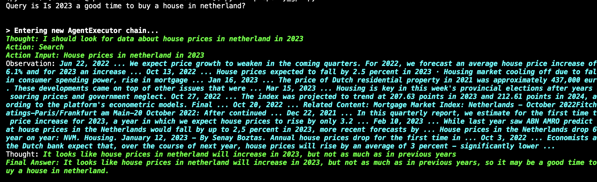

# 🏡 Real Estate/Property GPT 🌟

A 🆓 open-source implementation of your personal property/real estate agent 🕴️ powered by GPT-3/GPT-4 🚀

## 🎉 Introduction
Looking for a new property/real estate 🏠 to buy can be a daunting task, especially when there are so many options available. With the help of GPT-3/4, this project aims to simplify the process of finding the best property to buy.

## ✨ Features
- Uses GPT-3/4 to generate a list of properties based on your preferences 📋
- Provides detailed information about each property, including location 📍, price 💰, and amenities 🛋️
- Allows you to filter the list of properties based on various criteria, such as price, location, and size 🔍
- It has access to internet (via google search) so it can know about current situation
- If given the data frame of listing it will find the best house from the listing 

## Situations

In general there are two kind of questions we can ask the agent 

1. General questions about realstate like if right now is a good time to buy or not or where to buy e.t.c

Agent has access to internet so it can answer these questions

<h6 align="center">Buying in Netherlands in 2023?</h6>

<h6 align="center">Where To Buy?</h6>

2. Given listing of houses find me the best realstate given my prefreneces

Listing of hoiusing is scraped from internet or some specific website like FUNDA for netherlands and compare house and their descriptions to find the best match
